 > 对原始数据集中的数据个数进行了统计，对不同预测方法的可用训练集大小进行了估计。
 
 大方向上，我们有4种预测方法： 
 - 预测用户u对歌曲s的未来操作情况。 
 - 预测所有用户对歌曲s的未来操作情况。 
 - 预测用户u对艺人a的未来操作情况。 
 - 预测所有用户对艺人a的未来操作情况。 

以预测用户u对歌曲s的未来操作情况为例。原始数据集中，用户u对歌曲s有几天的操作记录会影响到实际可用的训练集的大小。因此，针对4种预测方法，对原始数据集中操作记录个数（以天为基本时间单位）进行了统计。

# 1. 用户u对歌曲s的操作天数
> 横坐标中每个点表示一个(用户u，歌曲s)pair，纵坐标表示在原始数据集中用户u对歌曲s的操作记录的不同天数。第一张图中将3种操作（播放，下载，收藏）合并为1种操作进行统计，剩余三张图分别考虑3种操作。
>   
> 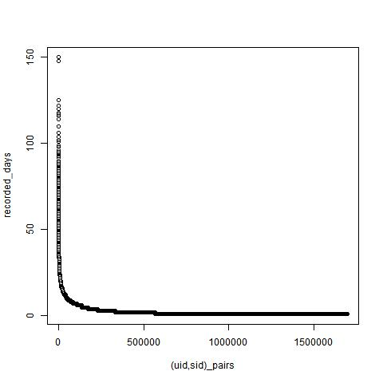
> 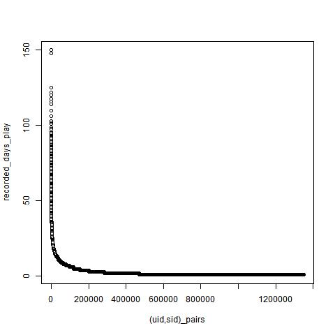
> 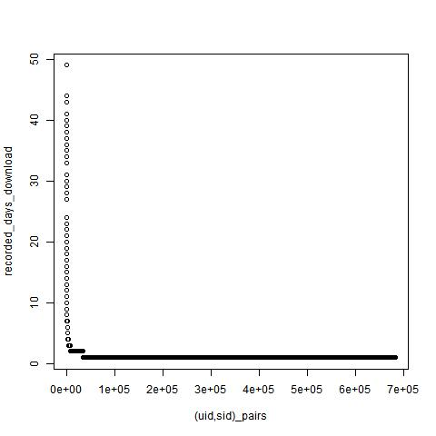
> 
> 
> 可以看到，大部分的用户u对歌曲s的操作记录天数较少，意味着训练集尺寸较小，较难预测这些用户u对歌曲s的未来操作情况。

# 2. 所有用户对歌曲s的操作天数
> 横坐标中每个点表示一首歌曲s，纵坐标表示所有用户对歌曲s的操作记录的不同天数。
>   
> 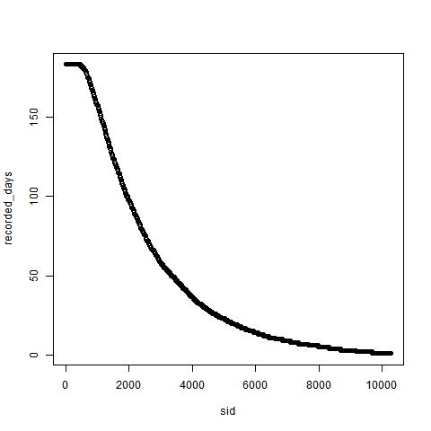
> 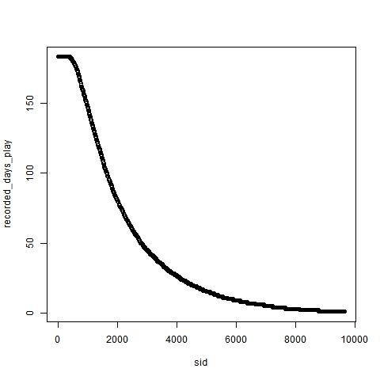
> 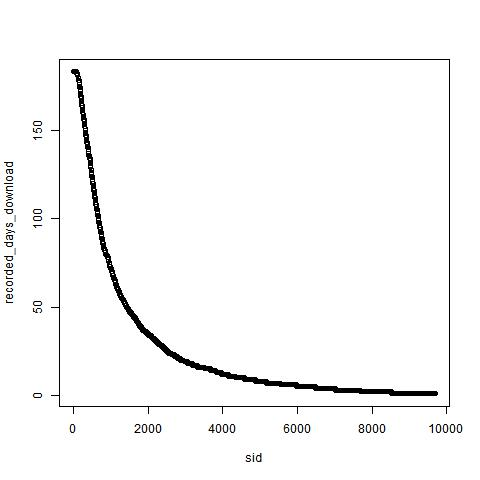
> 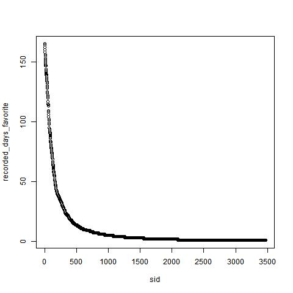
>
> 尽管我们不再对用户进行区分，但是对于大部分歌曲s，所有用户对歌曲s的操作记录天数还是较少的，意味着训练集尺寸较小，较难预测歌曲s的未来操作情况。

# 3. 用户u对艺人a的操作天数
> 横坐标中每个点表示一个(用户u，艺人a)pair，纵坐标表示在原始数据集中用户u对艺人a的操作记录的不同天数。
>   
> 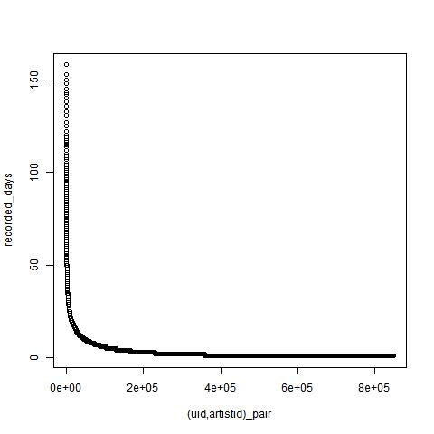
> 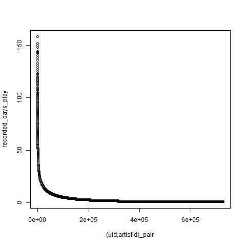
> 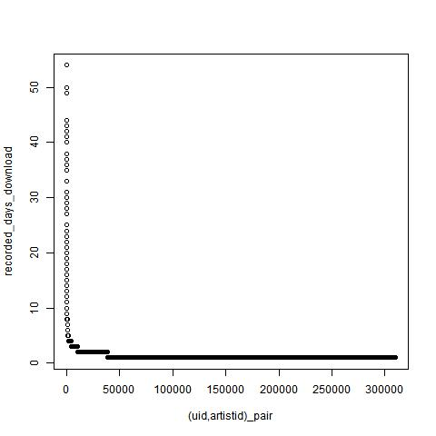
> 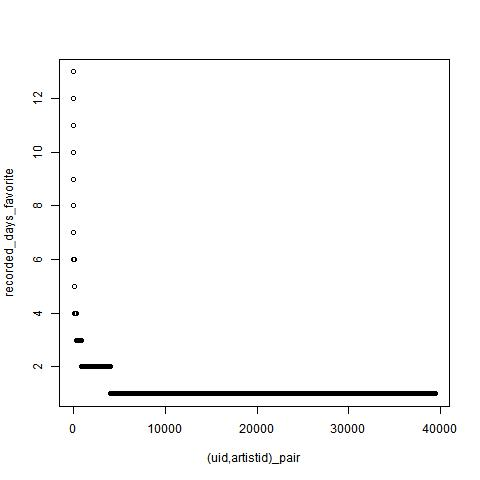
> 
> 可以看到，大部分的用户u对艺人a的操作记录天数较少，意味着训练集尺寸较小，较难预测这些用户u对艺人a的未来操作情况。

# 4. 所有用户对艺人a的操作天数
> 横坐标中每个点表示一个艺人a，纵坐标表示所有用户对艺人a的操作记录的不同天数。
>   
> 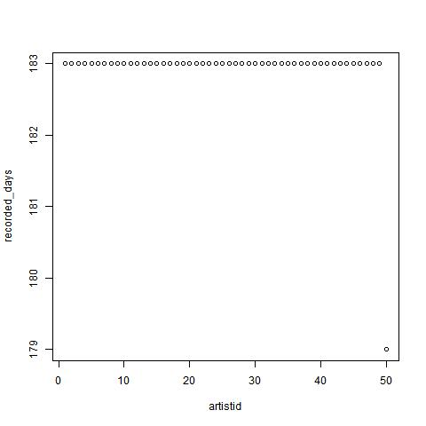
> 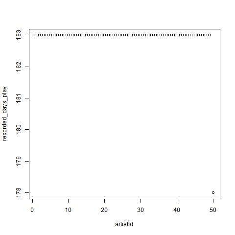
> 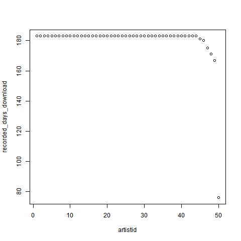
> 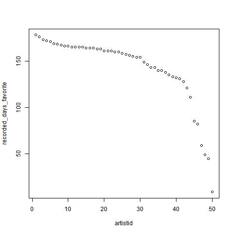
>
> 我们不再对用户进行区分，也不对歌曲进行区分，而是预测所有用户对艺人a的未来操作情况。这种情况下，我们对每个艺人a都有充足的操作记录天数。可以从第一张图看到，在不区分操作（播放，下载，收藏）的情况下，大部分艺人都有183天的操作记录，也就是全部6个月的操作记录。

